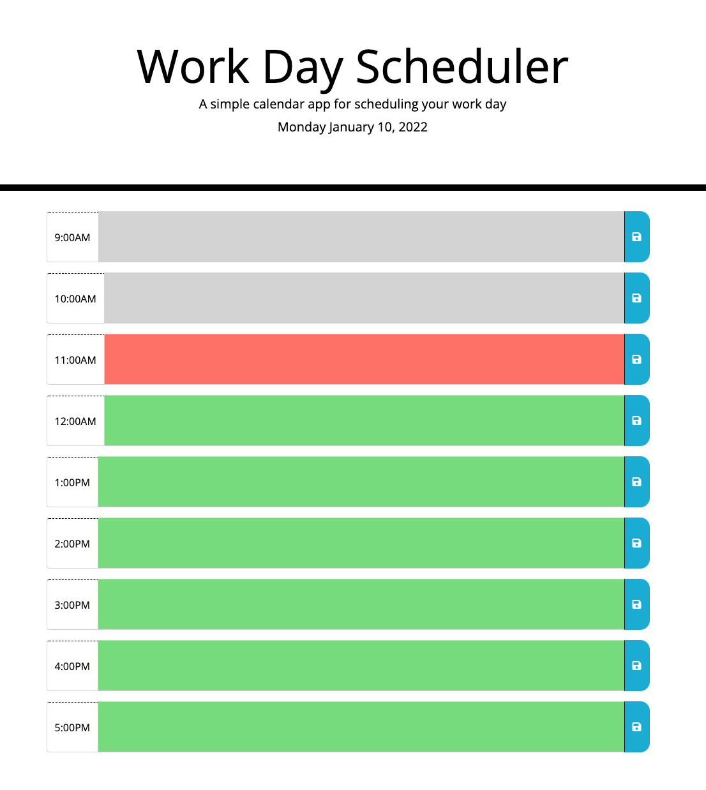

# bootcamp-week5-homewrok

This repository holds the code for the "Universiuty of Sydney Full Stack FLex Bootcamp" week 5 homework. The page is a work day scheduler consisting of time slots from 9asm to 5pm, which allows users to write and store events in each time slot. The saved events will persist through page reloads using local storage.

The first visit to the page presents the user with a black calandar page as seen below:

The time blocks are color coded as seen in the image based on the relative time. If a time block is in the past, it is grey, if it is the current time, it is r ed, and if it is a future time, it is green.

After saving an event using the blue save button on the right, the event that was written in the text box is saved to local storage under its time box and is the reloaded to the same time slot on page reload. Any change to that saved event will result in the localstorage being overwritten and the new event persisting.

The page is hosted using GitHub Pages and is viewable at this URL:
